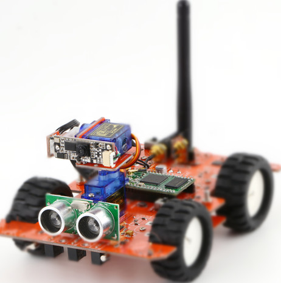

# line following and object detecting car with OpenCV
***

In this project, I used Python  OpenCV  and Arduino car to follow line and detect specific color object

The following techniques are used:

- Color Selection
- Line Detect
- PID motor control
